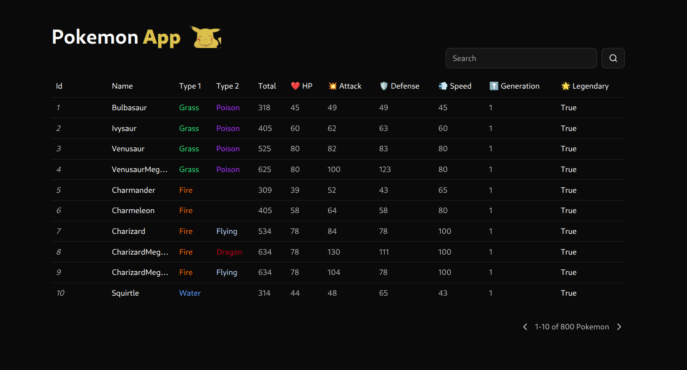
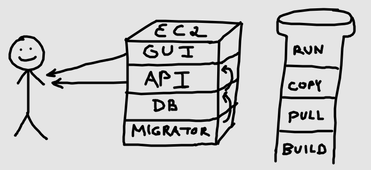

# Pokemon App

Pokemon App is a project I created to learn more about the full stack software development process using market leading technologies like Docker containers, CI/CD pipelines and EC2 Instances.

This project has given me the experience of the (semi) full software development life cycle for building web apps.

What I found to be the most interesting technology of this experience, was the EC2 instance. I find it really interesting how you can have some external server independently run processes that you can communicate with on any remote machine. Soon I'd like to get into the realm of kubernetes which I understand is a more elegant way of running multiple containers across multiple machines.

## Photos

## CI/CD Pipeline

Let's start with the CI/CD pipeline. The entire things was configured with the yaml language and leveraged the sophisticated github actions.

There's a serious headache involved with manually updating thing such as building and pushing your images, ssh-ing into remote instances to pull stuff. It's a very human-unfriendly process so the idea of automating such a headache with CI/CD pipelines is really a game changer. And if involving a team of multiple people there's less developer work being spent iterating through the boiler plate process of updating things.

So yeah, back to github actions. For what I used it for github actions was a very simplistic process. Within a yaml file you configure your different stages of a "job" and each job has a list of steps. Each job runs in on the same instance so think of it as a sequential process for each job and then alls the jobs run in parallel when executed.

Whats really nice is for each step within the jobs you can actually pull custom steps build by people from remote repositories and then configure inputs to perform certain actions based off how they developed their custom step. Very cool!

My pipeline consists of one job and six steps.

1. Checkout code.

   Your running this on a remote machine, you need to checkout your repo code, luckily github actions has a rebuilt action for this.

2. Login to Docker.

   The images that I made for this project need to be pushed to docker so they can be pulled by my remote server, luckily the good people at docker have us covered with their own action (see how your just using other people's actions, which is probably just a set of bash commands you run).

3. Build and push the API image to Docker Hub.

   Pretty self explanatory. Need to push this to the hub so we can pull it in our ec2 instance.

4. Build and push the GUI image to Docker Hub.

   Same thing as before.

5. Copy some files to the ec2.

   In order to sync the remote data base wih the local data base there's some sql code that I need to pass over to the ec2 instance. I also need to pass over the docker compose file too. I do this using a rebuilt scp action (it's like ssh but for copying).

6. Run EC2

   Finally I kick off the EC2. This is a fairly easy process, I basically just kick start the docker compose file.

## Docker

The four running services I have in my program are my GUI, database, migrator and API. They all run separately in containers via docker. The EC2 instance itself has docker installed and every time I push to the repo, the pipeline builds and pushes these images to docker hub which the ec2 instance pulls and runs.

### Docker Compose

In order to elegantly kick off my docker containers in the EC2 I'm using docker-compose. Basically how it works is for each service I have instruction set up indicating how I want to run it. Sometimes the way I want to run it can get pretty fancy. For instance for the GUI service I need to configure the ports that the container are going to expose to the EC2 instance and indicate which port that it's mapped to. Most of the time its just the same port.

## Frontend

The frontend uses React for development, Vite for generating builds and ShadCN for providing nifty GUI components. In order to host my application I need to create a create a build using vite and then have a container running nginx serve the build to the actual endpoint.

## Backend

The backend is very simple consisting of only two services, the database and the api.The database uses postgresql and go migrate for generating schema migrations. The api is written in express and just has a few simple endpoints setup to run read operations on the database.

### The Data

As implied by the title the database contains a single table that contains information about 800 pokemon.

## DevOps

All of the services within the application run off an EC2 instance from AWS. This EC2 instance exposes various ports pertaining the ports that tunnel into the docker containers that run on the EC2 instance.

## Retrospective

All in all I learned a lot of from this brief little project. The main takeaway was learning how to properly create a CI/CD pipeline using github actions as well as host different web services on an EC2 instance.

In the future I want to incorporate terraform into this project so that anyone with the push of a commit can get this running.
